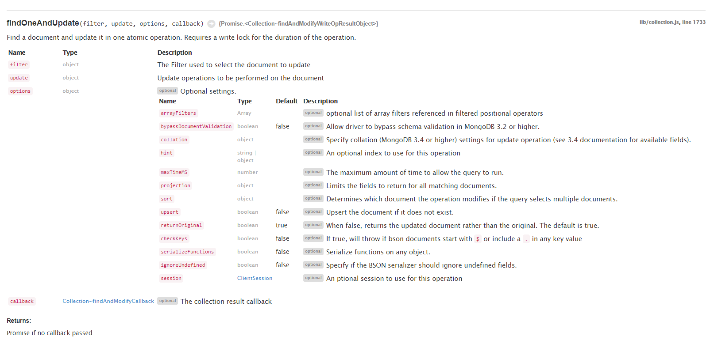

# [Node.js MongoDB Driver API](http://mongodb.github.io/node-mongodb-native/3.6/api/index.html)

        findOneAndUpdate(filter, update, options, callback){Promise.<Collection~findAndModifyWriteOpResultObject>}

Find a document and update it in one atomic operation. Requires a write lock for the duration of the operation.

		
filter	object	
The Filter used to select the document to replace

replacement	object	
The Document that replaces the matching document

options	object	optional
Optional settings.